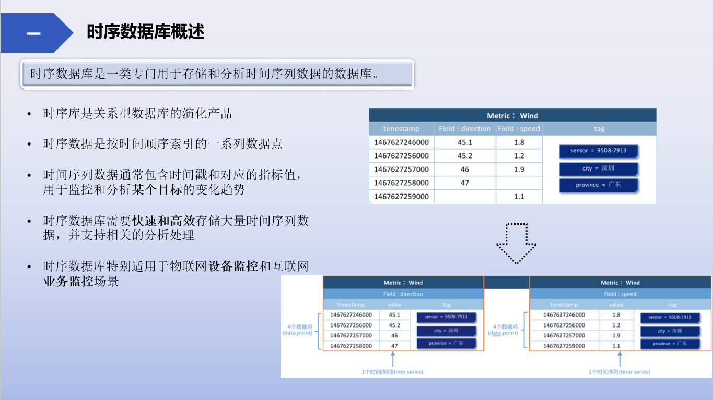
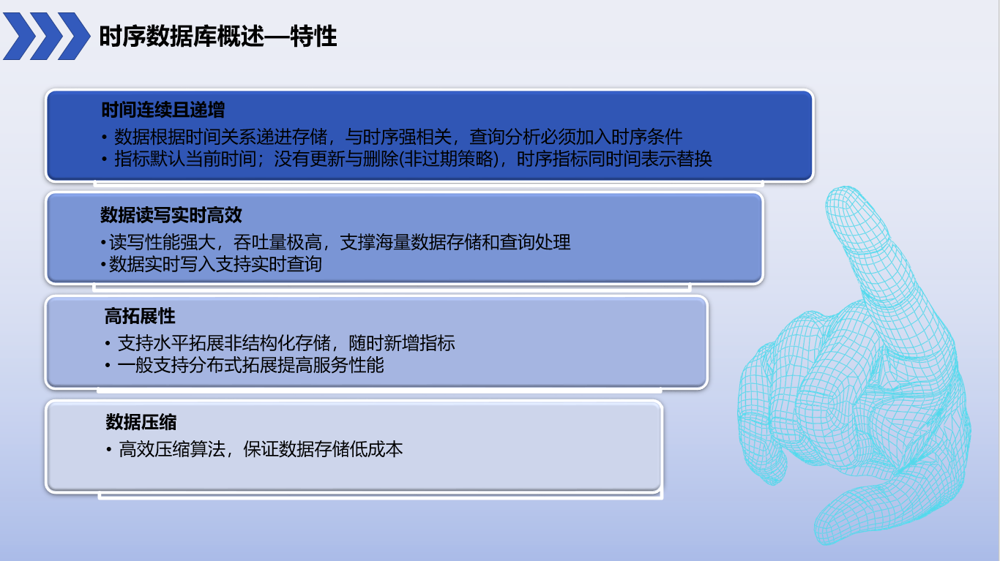
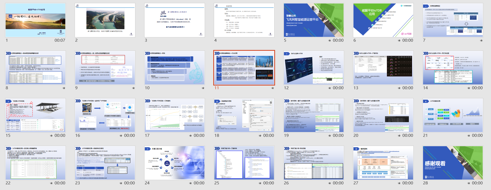
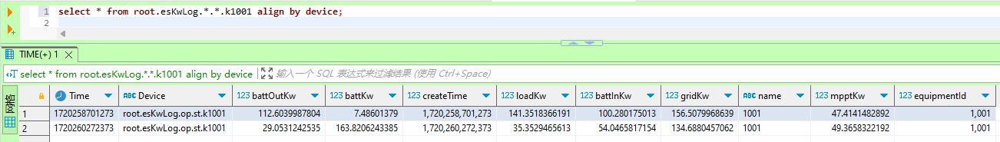

# IoTDB-Mybatis及基础应用
    本工程仅嵌入IotDB基础应用，包括IoTDB结合Mybatis操作和简化的时序数据对象增删查改开发流程，以及DTS数据同步的应用示例。
    对IoTDB的内容不做过多介绍，暂不提供实际线上工程其他内容及高级应用（原工程：飞充网智慧能源(BigData-IoTDB)）。

## 背景
- 飞充网智慧能源+充电站运营管理云平台，为客户提供完善、灵活的充电站整体解决方案，快速部署光储充一体化新能源服务网络。
- [时序数据库IoTDB](https://iotdb.apache.org/)在该应用设备指标监控、流程日志等模块中扮演重要角色。将IoTDB与Mybatis框架结合，能极大方便时序库应用以及降低学习成本，本项目仅为主要基本功能示例。
- <a href='https://fycev.com/'>英飞源-飞充网智慧能源</a>

## 特性

- IoTDB接入Mybatis，定义时序对象、ORM配置后即可使用，低学习成本，易用易拓展；
- 不需要过于复杂的JDBC/ORM-XML的编码即可执行自定义数据对象的读写操作;
- 支持官方工具包JDBC操作，补充ORM难于实现的更新操作，支持高效api批量插入；
- 动态管理设备时序属性，无需先新增属性再执行入库操作，直接操作数据；
- 方便工程拓展，使用装饰器实现需要的其他备选库持久化操作，如MYSQL等；
- 针对不便处理的时序路径、数据类型等，使用工程自定义的执行器完成相关逻辑；
- 注解简化处理字符串参数类型查询匹配
- iotdb异步数据备份，历史数据DTS服务
- 接口集成测试，方便快速测试

## 工程结构

- [iotdb-mybatis-core](iotdb-mybatis-core) 核心工程模块，包含session的时序插入和mybatis集成的查询DML操作
- [common-domain](common-domain) 领域模型，包含时序数据实体及其他公共参数相关实体
- [iotdb-history-dts](iotdb-history-dts) 历史数据DTS服务
- [application-demo](application-demo) 示例应用工程，包含时序数据实体查询新增触发等操作，集成测试接口验证等

## 部署准备

- iotdb部署
    - 支持docker或jar运行部署
    - 推荐官方文档集群部署方案
- 加入[iotdb-mybatis-core](iotdb-mybatis-core)[iotdb-mybatis-core](iotdb-mybatis-core)工程
    - 工程作为module嵌入到目标应用工程
    - 根据#开发流程自定义需要的时序数据逻辑

## 测试验证（示例）

- 完善数据库连接和应用配置，运行Application
- 接口http://localhost:8060/logKw/random/add?equipmentId=1001 新增时序实体数据
- 接口http://localhost:8060/logKw/list/days?equipmentId=1001&days=7 查询数据
- 接口http://localhost:8060/logKw/dts/logKw?equipmentId=1001&days=7 dts历史数据同步

  

## 配置信息

- 配置中增加多数据源依赖
    - #iotdb配置，根据配置和实际部署，自定义参数
        - spring.datasource.iotdb.username = 用户名
        - spring.datasource.iotdb.password = 密码
        - spring.datasource.iotdb.host = ip
        - spring.datasource.iotdb.port = 6667(或设定的端口)
        - spring.datasource.iotdb.driver-class-name = org.apache.iotdb.jdbc.IoTDBDriver
        - spring.datasource.iotdb.jdbc-url = jdbc:iotdb://${spring.datasource.iotdb.host}:${spring.datasource.iotdb.port}/
        - spring.datasource.iotdb.initial-size = 5
        - spring.datasource.iotdb.min-idle = 10
        - spring.datasource.iotdb.max-active = 50
        - spring.datasource.iotdb.max-wait = 60000
        - spring.datasource.iotdb.remove-abandoned = true
        - spring.datasource.iotdb.remove-abandoned-timeout = 30
        - spring.datasource.iotdb.time-between-eviction-runs-millis = 60000
        - spring.datasource.iotdb.min-evictable-idle-time-millis = 300000
        - spring.datasource.iotdb.test-while-idle = false
        - spring.datasource.iotdb.test-on-borrow = false
        - spring.datasource.iotdb.test-on-return = false
        - spring.datasource.iotdb.druid.pool-prepared-statements = true

## 开发流程
### 开发主要变更点
按需在[iotdb-mybatis-core]模块中的Modules包中新增所需时序数据实体操作；

-
    1. 新增枚举类型DataCategoryEnum，定义数据在iotdb中的设备时序前缀（库）；
-
    2. 定义持久化信息实体，在需要入库的属性上加上@DataField注解；
        - 标识时序属性和数据类型
        - 实体必须包含createTime/createDate/acquisitionTime属性之一，用于框架记录时序时间
-
    3. 定义ORM相关Mapper类和xml文件，用于对象关系映射查询操作

    - Mapper类需继承IotDbBaseMapper<T, Q>
    - 最少包含queryPage、queryCount、queryCountList、delete基础方法实现
-
    4. 定义业务调用接口和Service实现类

    - Service实现类需继承AbstractIotDbUpdateService<T>
    - 按需实现insert、queryAll、update、delete、insertBatch及自定义业务方法

### Contact Us  
<mailto:endcy#qq.com>

### 其他疑问
主要参考<a href="https://iotdb.apache.org/">IoTDB官网</a>及<a href = "https://github.com/apache/iotdb/issues">官方Issues</a>  
